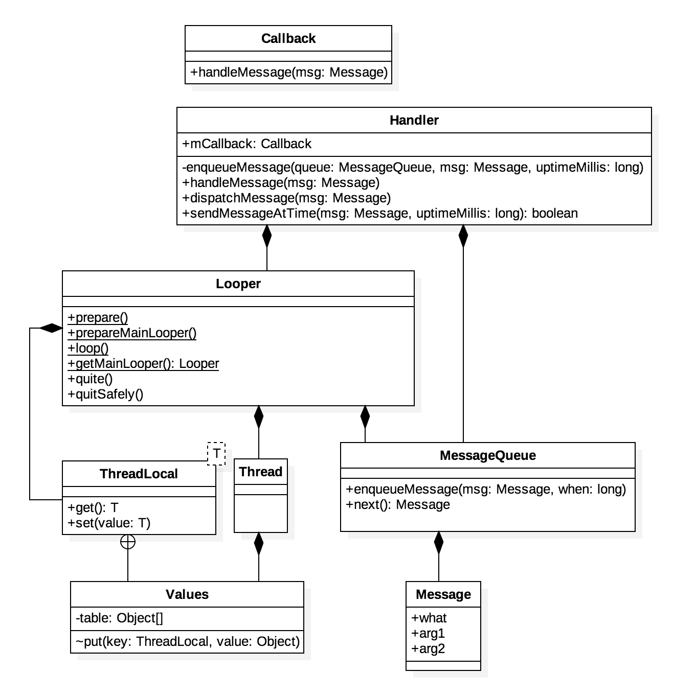
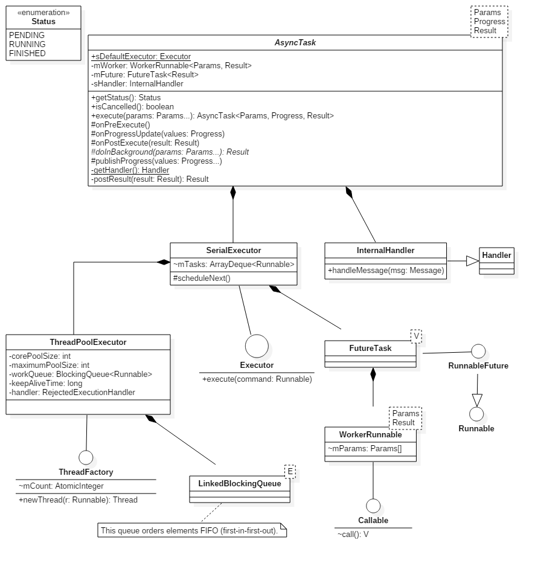

# Nd Presentation

## 异步框架

`Android` 的 `UI` 控件并不是线程安全的，也就说只能在 `UI` 线程也就说主线程更新 `UI`，如果在非 `UI` 线程更新 `UI`，则可能导致异常。另外一方面，`Android` 又要求不能在 `UI` 线程执行耗时的任务。然而，我们在开发 `App` 过程中，经常面对的场景是，处理一段耗时的逻辑，处理完成后将结果呈现给 `UI`，这就产生了矛盾，因此有了 `Android` 异步框架。开发者可以在工作线程进行耗时的操作，待耗时操作完成后，通过异步框架将线程切换到 `UI` 线程，呈现操作结果。

`Android` 异步框架由 `Handler`, `Looper`, `Message` 三部分组成。其中，`Message` 是一个单链表数据结构，负责存储消息；`Handler` 往消息队列 `Message` 发送消息；`Looper` 不断从消息队列里读取消息，如果有新的消息到达，取出消息，并分发给 `Handler` 预先定义好的 `Hook` 函数去处理。

除了上述三部分，完成线程切换的秘诀在于 `ThreadLocal`。简单的说，`ThreadLocal` 允许我们通过同一个对象在不同线程中存储不同的数据。具体到 `Android` 异步框架，就是存储每个线程的 `Looper` 对象。




### AsyncTask

`AsyncTask` 是 `Google` 为了简化 `Android` 中的异步编程而封装出的一个类。`AsyncTask` 实际上用到还是 `Android` 异步框架，只是 `Google` 将实现细节隐藏了，通过暴露几个关键的方法，让开发者很容易实现自己的异步任务，简化了实现异步任务的复杂性和可控制性。

`AsyncTask` 最基本的使用方法很简单，创建一个任务类，使这个类继承自 `AsyncTask` 类，重写下面四个方法：

- `AsyncTask#onPreExecute()`
- `AsyncTask#doInBackground()`
- `AsyncTask#onProgressUpdate()`
- `AsyncTask#onPostExecute()`
 
然后调用 `AsyncTask#execute()` 方法开始异步任务，这样我们就不必定义 `Handler`，不必发送消息和处理消息，降低了异步编程的复杂度。

`AsyncTask#execute()` 返回的是 `AsyncTask` 引用，通过这个引用我们可以在适当时候比如在 `Activity` 的某个生命周期方法中取消这个任务，提高了异步任务的可控制性。



这里，我们试着解释几个结论：

- `AsyncTask#onPreExecute()` 运行在调用 `AsyncTask#execute()` 所在的线程。
- `AsyncTask#doInBackground()` 运行在工作线程；
- `AsyncTask#onProgressUpdate()` 运行在 `UI` 线程；
- `AsyncTask#onPostExecute()` 运行在主线程；
- 永远不要手动调用上述方法。

后面三个都没问题，但是关于第一个结论，一直以来我一直以为 `AsyncTask#onPreExecute()` 也是运行在 `UI` 线程，因为 `Android` 官方文档给出的解释：

> Runs on the UI thread before doInBackground(Params...).

其实，通过源码可以发现，这个结论是错的。`AsyncTask#execute()` 最终会调用 `AsyncTask#executeOnExecutor()`, 让我们重新看看这个方法的具体代码：

```
if (mStatus != Status.PENDING) {
    switch (mStatus) {
        case RUNNING:
            throw new IllegalStateException("Cannot execute task:"
                    + " the task is already running.");
        case FINISHED:
            throw new IllegalStateException("Cannot execute task:"
                    + " the task has already been executed "
                    + "(a task can be executed only once)");
    }
}
mStatus = Status.RUNNING;
onPreExecute();
mWorker.mParams = params;
exec.execute(mFuture);
return this;
```

可以看出，在任务开始之前，只是简单地调用 `AsyncTask#onPreExecute()` 通知外部，所以 `AsyncTask#onPreExecute()` 所在的线程和调用 `AsyncTask#execute()` 是同一个线程，只是我们一般都在 `UI` 线程启动 `AsyncTask`，所以一般都认为 `AsyncTask#onPreExecute()` 运行在主线程。

### HandlerThread

如果要在一个线程中初始化一个 `Handler` 对象必须有一个前提条件，那就是该线程具有 `Looper` 循环。如果在一个没有 `Looper` 循环的线程中获取 `Handler` 对象，将抛出如下异常：

```
FATAL EXCEPTION: #SimpleThread
Process: me.aaronchan.ndpresentation, PID: 19566
java.lang.RuntimeException: Can't create handler inside thread that has not called Looper.prepare()
    at android.os.Handler.<init>(Handler.java:200)
    at android.os.Handler.<init>(Handler.java:114)
    at me.aaronchan.ndpresentation.activity.HandlerCreationActivity$SimpleThread.run(HandlerCreationActivity.java:49)
```

那么，`HandlerThread` 和普通的 `Thread` 有什么区别呢？其实它们之间的区间就在于 `HandlerThread` 是一个带有消息循环 `Looper` 的 `Thread`。换句话说，我们可以在 `HandlerThread` 中直接创建 `Handler`。一起看看 `HandlerThread` 具体是怎么是实现的，关键在 `HandlerThread#run()` 方法：

```
@Override
public void run() {
    mTid = Process.myTid();
    Looper.prepare();
    synchronized (this) {
        mLooper = Looper.myLooper();
        notifyAll();
    }
    Process.setThreadPriority(mPriority);
    onLooperPrepared();
    Looper.loop();
    mTid = -1;
}
```

在 `HandlerThread#run()` 方法里，首先使用 `Looper.prepare()` 初始化消息循环 `Looper`，通过 `onLooperPrepared()` 通知外界，`Looper` 初始化完成，然后就直接开启消息循环 `Looper.loop()`。所以，之所以我们能够在 `HandlerThread` 中创建 `Handler`，是因为 `HandlerThread` 已经默认为我们创建并开启了一个消息循环。这和 `Android` 主线程 [ActivityThread](https://github.com/android/platform_frameworks_base/blob/master/core/java/android/app/ActivityThread.java#L5472) 的情况是类似的。

### IntentService 

`IntentService` 是一个 `Service` 子类，其内部有一个工作线程用来逐一处理异步任务，当异步任务结束后 `IntentService` 会自动停止。通常情况用在应用后台数据下载。


当然，我们也可以直接开一个工作线程完成上述任务，`IntentService` 的优势在哪里呢？在 Andriod 中，进程按照重要程度可以分为以下5个等级：

1. 前台进程（可见可交互）
2. 可见进程（可见不可交互）
3. 服务进程
4. 后台进程
5. 空进程

Android 系统将尽量长时间地保持应用进程，但是当系统资源不足时，Android 就会按照上述优先级，从低到高依次回收进程，释放系统资源以确保高优先级进程的正常运行。
 
这里需要补充一点，一个进程的优先级是由该进程内的所有线程的最高优先级确定的。`IntentService` 归根到底是四大组件之一 `Service`，因此在系统资源优先级上要高于普通的工作线程，因此如果使用 `IntentService` 可以提高整个应用进程的优先级。如果应用中的某些数据比较重要，开发者不希望后台在下载这些数据时线程被回收，可以考虑使用 `IntentService` 来提高后台任务的优先级。

其实 Android 的四大组件都是运行在主线程的，`Service` 同样也是。那么，`IntentService` 的内部是如何工作的呢？它是怎么让 `Service` 具有完成异步任务的功能？其实，`IntentService` 内部非常重要的一个角色就是之前介绍的 `HandlerThread`。首先，我们看看 `IntentService#onCreate()` 方法：

```
@Override
public void onCreate() {
    // TODO: It would be nice to have an option to hold a partial wakelock
    // during processing, and to have a static startService(Context, Intent)
    // method that would launch the service & hand off a wakelock.
    super.onCreate();
    HandlerThread thread = new HandlerThread("IntentService[" + mName + "]");
    thread.start();
    mServiceLooper = thread.getLooper();
    mServiceHandler = new ServiceHandler(mServiceLooper);
}
```

在 `IntentService#onCreate()` 方法里做了3件事情：

- 创建了一个 `HandlerThread` 线程，作为工作线程
- 启动 `HandlerThread` 线程
- 通过 `HandlerThread` 的 `Looper` 创建 `mServiceHandler`

上述步骤结束后，我们就得到了一个 `Handler` 对象 `mServiceHandler`，通过它发送的消息都会在工作线程中进行处理。接下来，看看 `IntentService` 的几个主要生命周期方法都做了什么？启动服务 `onStartCommand()` 方法：

```
@Override
public int onStartCommand(Intent intent, int flags, int startId) {
    onStart(intent, startId);
    return mRedelivery ? START_REDELIVER_INTENT : START_NOT_STICKY;
}
```

这边是直接调用 `onStart()` 方法，跳转到 `onStart()` 方法：

```
@Override
public void onStart(Intent intent, int startId) {
    Message msg = mServiceHandler.obtainMessage();
    msg.arg1 = startId;
    msg.obj = intent;
    mServiceHandler.sendMessage(msg);
}
```

到这一步就很清楚了，当我们开始 `IntentService` 时，我们会将外部传进来的 `Intent` 对象作为 `Message` 的 `obj`，并通过 `mServiceHandler` 发送消息。这里还需要传递一个参数 `startId`，`IntentService` 之所以可以在异步任务结束后自动停止，就是要根据这个参数调用 `Service#stopSelf()`。

当 `mServiceHandler` 从工作线程的消息队列取出消息后，会调用 `IntentService#onHandleIntent()` 抽象方法，异步任务的具体操作逻辑都在这里。

额外提一点，在使用 `IntentService` 时必须由子类显示调用其构造方法，传入的参数将作为工作线程的线程名称。

运行示例代码，可以发现，`IntentService` 只能以序列化的方式处理异步任务，并且只有当处理完所有的 `Intent` 之后，才会销毁服务：

```
05-09 08:36:15.989 7277-7277/me.aaronchan.ndpresentation D/SimpleService: onCreate
05-09 08:36:15.989 7277-7277/me.aaronchan.ndpresentation D/SimpleService: onStartCommand
05-09 08:36:15.989 7277-7277/me.aaronchan.ndpresentation D/SimpleService: onStartCommand
05-09 08:36:15.989 7277-7277/me.aaronchan.ndpresentation D/SimpleService: onStartCommand
05-09 08:36:15.990 7277-7277/me.aaronchan.ndpresentation D/SimpleService: onStartCommand
05-09 08:36:16.010 7277-7277/me.aaronchan.ndpresentation D/SimpleService: onStartCommand
05-09 08:36:18.011 7277-8597/me.aaronchan.ndpresentation D/SimpleService: Task in IntentService[SimpleService] #0 done.
05-09 08:36:20.012 7277-8597/me.aaronchan.ndpresentation D/SimpleService: Task in IntentService[SimpleService] #1 done.
05-09 08:36:22.013 7277-8597/me.aaronchan.ndpresentation D/SimpleService: Task in IntentService[SimpleService] #2 done.
05-09 08:36:24.014 7277-8597/me.aaronchan.ndpresentation D/SimpleService: Task in IntentService[SimpleService] #3 done.
05-09 08:36:26.015 7277-8597/me.aaronchan.ndpresentation D/SimpleService: Task in IntentService[SimpleService] #4 done.
05-09 08:36:26.015 7277-7277/me.aaronchan.ndpresentation D/SimpleService: onDestroy
```

## View 事件分发机制

### 事件和事件序列（手势）

在 Android 中，事件可以分为：

- `ACTION_DOWN` 
- `ACTION_UP` 
- `ACTION_MOVE` 
- `ACTION_POINTER_UP`
- `ACTION_POINTER_DOWN`
- `ACTION_CANCEL`

事件序列总是从 `ACTION_DOWN` 开始，中间伴随着不定个数的 `ACTION_MOVE`，最终以 `ACTION_UP` 结束。要理解 Android 事件体系，需要从事件序列（或者称为手势）的角度去看待，每一个事件并不是孤立的个体，事件总是存在于某一个完成的事件序列中。

### 几个重要方法

事件分发过程由三个方法共同完成：dispatchTouchEvent、onInterceptTouchEvent 和 onTouchEvent。现在分别介绍如下：

- public boolean dispatchTouchEvent(MotionEvent event)

用来进行事件分发。如果事件能够传递到当前 View，此方法一定会被首先调用，返回值由当前 View 的 onTouchEvent 和子 View 的 dispatchTouchEvent 共同决定，表示是否消耗当前事件。

- public boolean onInterceptTouchEvent(MotionEvent event)

只有 ViewGroup 包含此方法，View 没有该方法。在 dispatchTouchEvent 内部调用，用来判断是否拦截某个事件，如果当前 View 拦截了某个事件，那么同一事件序列中，此方法不会被再次调用，返回结果表示是否拦截当前事件。

- public boolean onTouchEvent(MotionEvent event)

同样在 dispatchTouchEvent 内部调用，用来处理点击事件，返回结果表示是否消耗当前事件。如果不消耗，在同一事件序列中，当前 View 无法再次接收到事件。

### 常见的事件分发场景

- 所有的 `View` 都没有消费事件


- 子 `View` 消费事件

 

- 父 `View` 拦截事件

 

### 几个结论

1. 同一个事件序列是指从手指接触屏幕的那一刻起，到手指离开屏幕的那一刻结束。在这个过程中所产生的一系列事件，这个事件序列以 down 事件开始，中间含有数量不定的 move 事件，最终以 up 结束。
2. 正常情况下，一个事件序列只能被一个 View 拦截并且消耗。只要一个 View 拦截了某一事件，那么同一事件序列内的所有事件都会交给它处理。
3. 某个 View 一旦决定拦截，那么这一事件序列都只能由它来处理，并且它的 onInterceptTouchEvent 将不会被再调用。
4. 某个 View 一旦开始处理事件，如果它不消耗 ACTION_DOWN 事件，那么同一事件序列的其他事件都不会再交给它处理，并且事件将重新交给它的父容器去处理，即父容器的 onTouchEvent 会被调用。
5. 如果 View 不消耗除 ACTION_DOWN 以外的其他事件，这个点击事件会消失，此时父容器的 onTouchEvent 并不会被调用，并且当前 View 可以持续收到后续事件，最终这些消失的点击事件会传递给 Activity 处理。
6. ViewGroup 默认不拦截任何事件。
7. View 没有 onInterceptTouchEvent 方法，一旦有点击事件传递给它，它的 onTouchEvent 就会被调用。
8. View 的 onTouchEvent 默认都会消耗事件，除非它是不可点击的，所谓不可点击是 clickable 和 longClickable 同时为 false。需要注意的是 View 的 longClickable 默认为 false；而 clickable 要分情况，比如 Button 默认为 true，而 TextView 默认为 false。
9. View 的 enabled 属性不影响 onTouchEvent 的默认返回值。
10. onClick 会触发的前提是当前 View 是可点击的，并且它收到了 down 和 up 事件。
11. 事件传递的顺序是由外向内的，即事件总是先传递给父容器，然后再由父容器分发给子 View。但是通过 requestDisallowInterceptTouchEvent 方法可以在子 View 干预父容器的事件分发，ACTION_DOWN 除外。这点是处理滑动冲突，内部拦截法的基础。

### 源码解析

- 事件入口

现在，我们尝试从源码角度去解释上面列出的几个结论。需要做的第一件事情是找出事件的入口在哪里，当手指触碰屏幕的那一刻，手机屏幕的触摸板接收到事件，然后触摸板会将事件传给硬件驱动层，驱动层再将事件转交给 Android 系统，最终会传递到 Android 框架层。那么，我们关心的是事件在 `Android` 框架层的入口在哪里？其实就是 `Activity`。当屏幕收到一个事件时，一定会首先传给 `Activity`，也就是说 `Activity#dispatchTouchEvent()` 会被调用：

```
public boolean dispatchTouchEvent(MotionEvent ev) {
    if (ev.getAction() == MotionEvent.ACTION_DOWN) {
        onUserInteraction();
    }
    if (getWindow().superDispatchTouchEvent(ev)) {
        return true;
    }
    return onTouchEvent(ev);
}
```

代码很少，但是代码少不代表简单。这里会判断事件类型，如果是 `ACTION_DOWN`，则调用 `onUserInteraction()` 通知外部，用户开始和当前页面交互；紧接着调用 `getWindow().superDispatchTouchEvent()` 方法，如果返回 `true` 则分发结束，否则将调用 `Activity#onTouchEvent()` 方法。直观上的理解，`getWindow().superDispatchTouchEvent()` 做的事情就是让 `Activity` 的所有子 `View` 去分发事件，并且如果所有的子 `View` 都没有消费这个事件，也就是 `getWindow().superDispatchTouchEvent()` 返回 `false`，那么这个事件就由 Activity 处理，即调用 `Activity#onTouchEvent()` 方法。其实，这种情况就是上述的场景#1。

那么，`getWindow().superDispatchTouchEvent()` 具体做了什么呢？点击去发现：

```
/**
 * Used by custom windows, such as Dialog, to pass the touch screen event
 * further down the view hierarchy. Application developers should
 * not need to implement or call this.
 *
 */
public abstract boolean superDispatchTouchEvent(MotionEvent event);
```

它是 `Window` 类的一个抽象方法，需要交由它的子类去实现。现在的问题变成，谁是 `Window` 的子类？其实从 `Window` 的注释中可以找到答案：

> /**
 * Abstract base class for a top-level window look and behavior policy.  An
 * instance of this class should be used as the top-level view added to the
 * window manager. It provides standard UI policies such as a background, title
 * area, default key processing, etc.
 *
 * <p>The only existing implementation of this abstract class is
 * android.view.PhoneWindow, which you should instantiate when needing a
 * Window.
 */
 
`Window` 抽象类的唯一实现类是 `android.view.PhoneWindow`。因此，我们找到 `PhoneWindow#superDispatchTouchEvent()` 方法：

```
@Override
public boolean superDispatchTouchEvent(MotionEvent event) {
    return mDecor.superDispatchTouchEvent(event);
}
```

一行代码，调用了 `mDecor#superDispatchTouchEvent()` 方法。`mDecor` 就是 `DecorView`，也就是 `Window` 的顶级 `View`。可以用视图层级分析工具 [Hierarchy Viewer](http://developer.android.com/intl/zh-cn/tools/help/hierarchy-viewer.html) 进行验证：


`DecorView` 是 `PhoneWindow` 的一个内部类，通过定义可以看出，它继承自 `FrameLayout`，因此 `mDecor#superDispatchTouchEvent()` 方法其实调用的是 `FrameLayout#dispatchTouchEvent()` 方法。

至此，事件就从 `Activity` 传递到了 `ViewGroup`。接下来，让我们分析事件在 `ViewGroup` 中的传递规则。

- `View` 事件分发

这里的 `View` 指的是单纯的 `View`，也就是不包含任何子 `View`。同 `Activity` 一样，`View` 的事件入口也是在 `dispatchTouchEvent()`，并且对于 `View` 来说没有拦截策略，即没有 `onInterceptTouchEvent()` 方法，对于一个事件，要么消费，要么回传给父 `View`。`View#dispatchTouchEvent()` 的关键代码如下：

```
/**
 * Pass the touch screen motion event down to the target view, or this
 * view if it is the target.
 *
 * @param event The motion event to be dispatched.
 * @return True if the event was handled by the view, false otherwise.
 */
public boolean dispatchTouchEvent(MotionEvent event) {
    
    ......
    
    final int actionMasked = event.getActionMasked();
    if (actionMasked == MotionEvent.ACTION_DOWN) {
        // Defensive cleanup for new gesture
        stopNestedScroll();
    }
    if (onFilterTouchEventForSecurity(event)) {
        //noinspection SimplifiableIfStatement
        ListenerInfo li = mListenerInfo;
        if (li != null && li.mOnTouchListener != null
                && (mViewFlags & ENABLED_MASK) == ENABLED
                && li.mOnTouchListener.onTouch(this, event)) {
            result = true;
        }
        if (!result && onTouchEvent(event)) {
            result = true;
        }
    }
    
    ......
    
    return result;
}
```

当 `View` 收到事件后，首先会判断是否设置了 `OnTouchListener`，如果 `OnTouchListener` 不为空，并且当前 `View` 处于可用状态（`enabled = true`），那么事件就交给 `OnTouchListener#onTouch()` 方法去处理，这个时候并不会调用 `View#onTouchEvent()` 方法。换句话说，如果对一个 `View` 设置了 `OnTouchListener`，它的优先级是比 `View#onTouchEvent()` 高的，它会拦截事件，使 `View#onTouchEvent()` 得不到执行。

如果 `OnTouchListener` 为空，事件就会传递到 `View#onTouchEvent()` 方法。到此，`View` 事件分发结束。

- `ViewGroup` 事件分发

`ViewGroup` 的事件分发相比 `Activity` 和单纯的 `View` 都要复杂的多。`ViewGroup` 的 `ViewGroup#dispatchTouchEvent()` 方法很长，但是核心处理流程可以用如下伪代码总结：

```
public boolean dispatchTouchEvent(MotionEvent event) {
    boolean consumed = false;
    if (onInterceptTouchEvent(event)) {
        consumed = onTouchEvent(event);
    } else {
        consumed = child.dispatchTouchEvent(event);
    }

    return consumed;
}
```

当一个事件能够传递到当前 `ViewGroup`，那么它的 `dispatchTouchEvent()` 方法一定会被调用。在 `dispatchTouchEvent()` 内部，首先会判断当前 `ViewGroup` 是否要拦截这个事件，如果拦截，即 `onInterceptTouchEvent()` 返回 `true`，则事件交给当前 `ViewGroup` 处理，即 `ViewGroup#onTouchEvent()` 将被调用，事件停止往下分发；如果 `ViewGroup` 不拦截这个事件，那么将调用 `child.dispatchTouchEvent()` 方法，即事件将传递给能接收到该事件的子 `View`，子 `View` 的事件分发再重复上述步骤。

接下来，我们具体分析下相关源码，首先是事件拦截逻辑，在 `ViewGroup#dispatchTouchEvent()` 找到如下代码片段： 

```
// Handle an initial down.
if (actionMasked == MotionEvent.ACTION_DOWN) {
    // Throw away all previous state when starting a new touch gesture.
    // The framework may have dropped the up or cancel event for the previous gesture
    // due to an app switch, ANR, or some other state change.
    cancelAndClearTouchTargets(ev);
    resetTouchState();
}

// Check for interception.
final boolean intercepted;
if (actionMasked == MotionEvent.ACTION_DOWN
        || mFirstTouchTarget != null) {
    final boolean disallowIntercept = (mGroupFlags & FLAG_DISALLOW_INTERCEPT) != 0;
    if (!disallowIntercept) {
        intercepted = onInterceptTouchEvent(ev);
        ev.setAction(action); // restore action in case it was changed
    } else {
        intercepted = false;
    }
} else {
    // There are no touch targets and this action is not an initial down
    // so this view group continues to intercept touches.
    intercepted = true;
}
```

进入事件拦截逻辑的条件有两个，`actionMasked == MotionEvent.ACTION_DOWN` 并且 `mFirstTouchTarget != null`。第一个条件是当前事件类型为 `ACTION_DOWN`，第二个条件 `mFirstTouchTarget != null` 怎么判断呢？对于第二个条件的判断要借助于 `cancelAndClearTouchTargets()` 方法，通过注释可以知道，当 `ViewGroup` 第一次接收到 `ACTION_DOWN` 时会调用这个方法：

```
/**
 * Cancels and clears all touch targets.
 */
private void cancelAndClearTouchTargets(MotionEvent event) {
    if (mFirstTouchTarget != null) {
        boolean syntheticEvent = false;
        if (event == null) {
            final long now = SystemClock.uptimeMillis();
            event = MotionEvent.obtain(now, now,
                    MotionEvent.ACTION_CANCEL, 0.0f, 0.0f, 0);
            event.setSource(InputDevice.SOURCE_TOUCHSCREEN);
            syntheticEvent = true;
        }
        for (TouchTarget target = mFirstTouchTarget; target != null; target = target.next) {
            resetCancelNextUpFlag(target.child);
            dispatchTransformedTouchEvent(event, true, target.child, target.pointerIdBits);
        }
        clearTouchTargets();
        if (syntheticEvent) {
            event.recycle();
        }
    }
}
```

当 `mFirstTouchTarget != null` 时，会调用 `clearTouchTargets()` 方法：

    /**
     * Clears all touch targets.
     */
    private void clearTouchTargets() {
        TouchTarget target = mFirstTouchTarget;
        if (target != null) {
            do {
                TouchTarget next = target.next;
                target.recycle();
                target = next;
            } while (target != null);
            mFirstTouchTarget = null;
        }
    }

在这里，会将 `mFirstTouchTarget` 重置为空。梳理一下，如果 `ViewGroup` 第一次接收到 `ACTION_DOWN` 事件，那么它会调用 `cancelAndClearTouchTargets()` 方法。`cancelAndClearTouchTargets()` 方法里的流程分两种情况：`mFirstTouchTarget != null` 和 `mFirstTouchTarget == null`。当 `mFirstTouchTarget == null` 时，什么都不做；当 `mFirstTouchTarget != null` 时会将 `mFirstTouchTarget` 重置为 `null`。因此，得出最后的结论，当 `ViewGroup` 第一次接收到 `ACTION_DOWN` 事件时，`mFirstTouchTarget != null` 不成立。

回到开始分析的地方，虽然 `mFirstTouchTarget != null` 不成立，但这两个条件是**或**的关系，因此条件块内部的代码还是会执行：

    if (actionMasked == MotionEvent.ACTION_DOWN
            || mFirstTouchTarget != null) {
        final boolean disallowIntercept = (mGroupFlags & FLAG_DISALLOW_INTERCEPT) != 0;
        if (!disallowIntercept) {
            intercepted = onInterceptTouchEvent(ev);
            ev.setAction(action); // restore action in case it was changed
        } else {
            intercepted = false;
        }
    }
    
读取标志位 `disallowIntercept`，这个标志位会受到子 `View` 是否调用 `ViewGroup#requestDisallowInterceptTouchEvent()` 的影响，如果标志位为 `true` 则父 `View` 不拦截事件。解决滑动冲突之内部拦截法就是根据这个方法实现的，后面会详细介绍。如果子 `View` 没有调用 `ViewGroup#requestDisallowInterceptTouchEvent()`，则会进入 `onInterceptTouchEvent()` 方法，默认情况下，`ViewGroup` 是不拦截事件的：

    public boolean onInterceptHoverEvent(MotionEvent event) {
        return false;
    }

到目前为止，`intercepted == false` 并且 `mFirstTouchTarget == null`。接着往下看，如果 `ViewGroup` 不拦截事件，它是怎么把事件分发给它的子 `View`：

    if (newTouchTarget == null && childrenCount != 0) {
        final float x = ev.getX(actionIndex);
        final float y = ev.getY(actionIndex);
        // Find a child that can receive the event.
        // Scan children from front to back.
        final ArrayList<View> preorderedList = buildOrderedChildList();
        final boolean customOrder = preorderedList == null
                && isChildrenDrawingOrderEnabled();
        final View[] children = mChildren;
        for (int i = childrenCount - 1; i >= 0; i--) {
            final int childIndex = customOrder
                    ? getChildDrawingOrder(childrenCount, i) : i;
            final View child = (preorderedList == null)
                    ? children[childIndex] : preorderedList.get(childIndex);
            // If there is a view that has accessibility focus we want it
            // to get the event first and if not handled we will perform a
            // normal dispatch. We may do a double iteration but this is
            // safer given the timeframe.
            if (childWithAccessibilityFocus != null) {
                if (childWithAccessibilityFocus != child) {
                    continue;
                }
                childWithAccessibilityFocus = null;
                i = childrenCount - 1;
            }
            if (!canViewReceivePointerEvents(child)
                    || !isTransformedTouchPointInView(x, y, child, null)) {
                ev.setTargetAccessibilityFocus(false);
                continue;
            }
            newTouchTarget = getTouchTarget(child);
            if (newTouchTarget != null) {
                // Child is already receiving touch within its bounds.
                // Give it the new pointer in addition to the ones it is handling.
                newTouchTarget.pointerIdBits |= idBitsToAssign;
                break;
            }
            resetCancelNextUpFlag(child);
            if (dispatchTransformedTouchEvent(ev, false, child, idBitsToAssign)) {
                // Child wants to receive touch within its bounds.
                mLastTouchDownTime = ev.getDownTime();
                if (preorderedList != null) {
                    // childIndex points into presorted list, find original index
                    for (int j = 0; j < childrenCount; j++) {
                        if (children[childIndex] == mChildren[j]) {
                            mLastTouchDownIndex = j;
                            break;
                        }
                    }
                } else {
                    mLastTouchDownIndex = childIndex;
                }
                mLastTouchDownX = ev.getX();
                mLastTouchDownY = ev.getY();
                newTouchTarget = addTouchTarget(child, idBitsToAssign);
                alreadyDispatchedToNewTouchTarget = true;
                break;
            }
            // The accessibility focus didn't handle the event, so clear
            // the flag and do a normal dispatch to all children.
            ev.setTargetAccessibilityFocus(false);
        }
        if (preorderedList != null) preorderedList.clear();
    }

上面这段代码有点长，但是仔细分析的话，它做的主要工作还是很清晰的：按照 `View` 的层级从上往下依次分发事件，直到 `ViewGroup#dispatchTransformedTouchEvent()` 返回 `true`，分发停止。这里面有两个方法需要注意，一个是 `ViewGroup#dispatchTransformedTouchEvent()`；另一个是 `ViewGroup#addTouchTarget()`。

我们先看看 `ViewGroup#dispatchTransformedTouchEvent(MotionEvent event, boolean cancel, View child, int desiredPointerIdBits)` 方法，`ViewGroup` 将事件分发给子 `View` 就是通过这个方法完成的，方法的注释如下：

> /**
 * Transforms a motion event into the coordinate space of a particular child view,
 * filters out irrelevant pointer ids, and overrides its action if necessary.
 * If child is null, assumes the MotionEvent will be sent to this ViewGroup instead.
 */

理解这个方法的关键在第三个参数 `child`。如果 `child != null`，那么方法就会调用 `child.dispatchTouchEvent()` 方法，也就完成了事件从父 `View` 到子 `View` 的分发；如果 `child == null`，那么方法就会直接调用 `ViewGroup` 的 `super.dispatchTouchEvent()` 方法，也就是 `View#dispatchTouchEvent()` 逻辑，到这边的逻辑就变成上一部分分析过的 **`View` 事件分发**，这里需要注意下区别。如果 `View#dispatchTouchEvent()` 方法返回 `false`，这种情况一般是因为子 `View` 的 `onTouchEvent()` 方法返回 `false`，最终会使 `ViewGroup#dispatchTransformedTouchEvent()` 也返回 `false`。从应用层角度去理解这段逻辑的话就很简单，即事件传递到了子 `View`，但是子 `View` 并没有消费这个事件，也就是最开始提到的场景#1（**所有的 `View` 都没有消费事件**）。这种情况下 `mFirstTouchTarget == null`，因此如果接收到后续的 `ACTION_MOVE` 和 `ACTION_UP` 事件都不会再调用 `ViewGroup#onInterceptTouchEvent()` 方法，并且会直接将 `intercepted` 置为 `false`，相关代码：

    if (actionMasked == MotionEvent.ACTION_DOWN
        ......
    } else {
        // There are no touch targets and this action is not an initial down
        // so this view group continues to intercept touches.
        intercepted = true;
    }
    
此时的事件都会交由下面的代码逻辑去处理：

    // Dispatch to touch targets.
    if (mFirstTouchTarget == null) {
        // No touch targets so treat this as an ordinary view.
        handled = dispatchTransformedTouchEvent(ev, canceled, null,
                TouchTarget.ALL_POINTER_IDS);
    }

这里 `child == null`，所以调用的是 `ViewGroup` 的 `super.dispatchTouchEvent()` 方法，即事件由 `ViewGroup` 处理。这里验证了 **第4个结论**。

再来看看 `ViewGroup#addTouchTarget()` 方法：

    /**
     * Adds a touch target for specified child to the beginning of the list.
     * Assumes the target child is not already present.
     */
    private TouchTarget addTouchTarget(View child, int pointerIdBits) {
        TouchTarget target = TouchTarget.obtain(child, pointerIdBits);
        target.next = mFirstTouchTarget;
        mFirstTouchTarget = target;
        return target;
    }

这里，会将消费掉当前事件的 `View` 添加到 `TouchTarget` 中，对 `mFirstTouchTarget` 赋值。这里，可以把 `TouchTarget` 简单理解成一个链表的数据结构。

考虑这么一种情况，

至此，事件 `ACTION_DOWN` 的分发就全部完成了。

事件 `ACTION_DOWN` 之后，是伴随着一系列 `ACTION_MOVE`。而事件 `ACTION_MOVE` 和事件 `ACTION_DOWN` 一样，首先会传递到 `ViewGroup#dispatchTouchEvent()` 方法。不过，这时候要确认两件事情：事件类型是 `ACTION_MOVE` 并且 `mFirstTouchTarget != null`。因此，还是会进入以下代码段：

    if (actionMasked == MotionEvent.ACTION_DOWN
            || mFirstTouchTarget != null) {
        final boolean disallowIntercept = (mGroupFlags & FLAG_DISALLOW_INTERCEPT) != 0;
        if (!disallowIntercept) {
            intercepted = onInterceptTouchEvent(ev);
            ev.setAction(action); // restore action in case it was changed
        } else {
            intercepted = false;
        }
    }

和之前情况不同的是，这次是通过第二个条件进入的。换言之，只要子 `View` 没有调用 `ViewGroup#requestDisallowInterceptTouchEvent()` 方法，所有的事件都会传递到 `ViewGroup#onInterceptTouchEvent()`。反之，如果子 `View` 调用了 `ViewGroup#requestDisallowInterceptTouchEvent()` 方法，`ViewGroup#onInterceptTouchEvent()` 方法将不会调用，也就是说 `ViewGroup` 的拦截策略将失效，这是后面要介绍的**内部拦截法**的理论基础。

上述结论有一个特殊情况，那就是当事件是 `ACTION_DOWN` 时，即使子 `View` 调用了 `ViewGroup#requestDisallowInterceptTouchEvent()` 方法，父 `View` 的 `onInterceptTouchEvent()` 方法一样会执行。这是因此，当事件是 `ACTION_DOWN` 时，会调用 `View#resetTouchState()` 方法，在 `View#resetTouchState()` 方法里会对标志位进行重置，`requestDisallowInterceptTouchEvent()` 更新的标志位也就失效了。这里验证了上面列出的**第11个结论**。

接下来的情况和事件 `ACTION_DOWN` 的分发过程类似，这里就不再复述了。
### 解决滑动冲突

- 同时水平滑动
- 一个水平滑动、一个竖直滑动
- 上述两种情况嵌套

### 一个例子

## 为什么要阅读源码

- Andriod 是完全开源的
- 知其然，知其所以然。了解底层，更好地服务上层
- 优秀的代码风格和设计理念。作为编码准则，尽量模仿，缩小差距
- 了解 `Android` 设计者的意图
- 更准确、快速地定位 **Bug**

## 参考

- **Android** 开发艺术探索
- [进程和线程](http://developer.android.com/intl/zh-cn/guide/components/processes-and-threads.html)
- [Mastering	the	Android Touch	System](http://files.cnblogs.com/files/sunzn/PRE_andevcon_mastering-the-android-touch-system.pdf)
