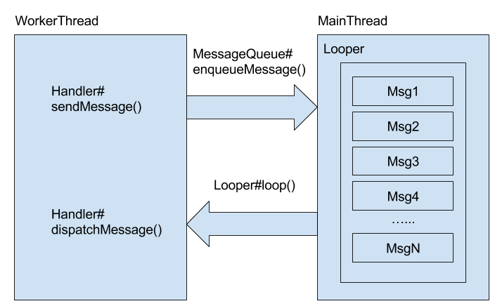

# ND Presentation

## 为什么要阅读源码

- 知其然，知其所以然。了解底层，更好地服务上层。
- 优秀的代码风格和设计理念。作为编码准则，尽量模仿，缩小差距。
- 了解 Android 设计者的意图。
- 更准确、快速地定位 Bug。

## 异步框架

### 三大件




Android 异步框架由 `Handler`, `Looper`, `Message` 三部分组成。其中，`Message` 是一个单链表，负责存储消息；`Handler` 往消息队列 `Message` 发送消息；`Looper` 不断从消息队列里读取消息，如果有新的消息到达，取出消息，并分发给 `Handler` 预先定义好的 Hook 函数去处理。

除了上述三部分，完成线程切换的秘诀在于 `ThreadLocal`。简单的说，`ThreadLocal` 允许我们通过同一个对象在不同线程中存储不同的数据。具体到 Android 异步框架，就是存储每个线程的 `Looper` 对象。

### AsyncTask

### HandlerThread

如果要在一个线程中初始化一个 Handler 对象必须有一个前提条件，那就是该线程具有 Looper 循环。如果在一个没有 Looper 循环的线程中获取 Handler 对象，将抛出如下异常：

```
FATAL EXCEPTION: #SimpleThread
Process: me.aaronchan.ndpresentation, PID: 19566
java.lang.RuntimeException: Can't create handler inside thread that has not called Looper.prepare()
    at android.os.Handler.<init>(Handler.java:200)
    at android.os.Handler.<init>(Handler.java:114)
    at me.aaronchan.ndpresentation.HandlerCreationActivity$SimpleThread.run(HandlerCreationActivity.java:49)
```

那么，HandlerThread 和普通的 Thread 有什么区别呢？其实它们之间的区间就在于 HandlerThread 是一个带有消息循环 Looper 的
Thread。换句话说，我们可以在 HandlerThread 中直接创建 Handler。一起看看 HandlerThread 具体是怎么是实现的，关键在 HandlerThread#run() 方法：

```
@Override
public void run() {
    mTid = Process.myTid();
    Looper.prepare();
    synchronized (this) {
        mLooper = Looper.myLooper();
        notifyAll();
    }
    Process.setThreadPriority(mPriority);
    onLooperPrepared();
    Looper.loop();
    mTid = -1;
}
```

在 HandlerThread#run() 方法里，首先使用 Looper.prepare() 初始化消息循环 Looper，通过 onLooperPrepared() 通知外界，Looper
初始化完成，然后就直接开启消息循环 Looper.loop()。所以，之所以我们能够在 HandlerThread 中创建 Handler，是因为 HandlerThread
已经默认为我们创建并开启了一个消息循环。这和 Android 主线程 [ActivityThread](https://github.com/android/platform_frameworks_base/blob/master/core/java/android/app/ActivityThread.java#L5472)
的情况是类似的。

### IntentService 

## 参考

- Android 开发艺术探索
