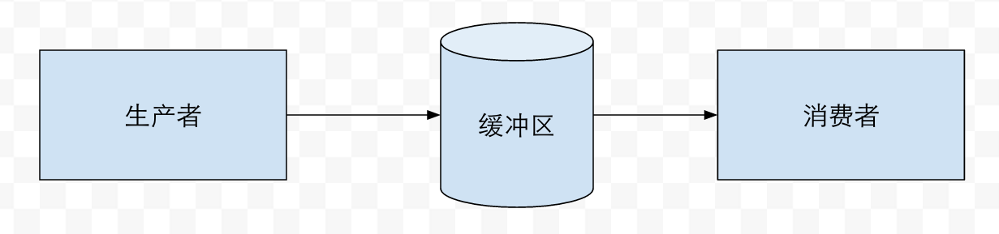
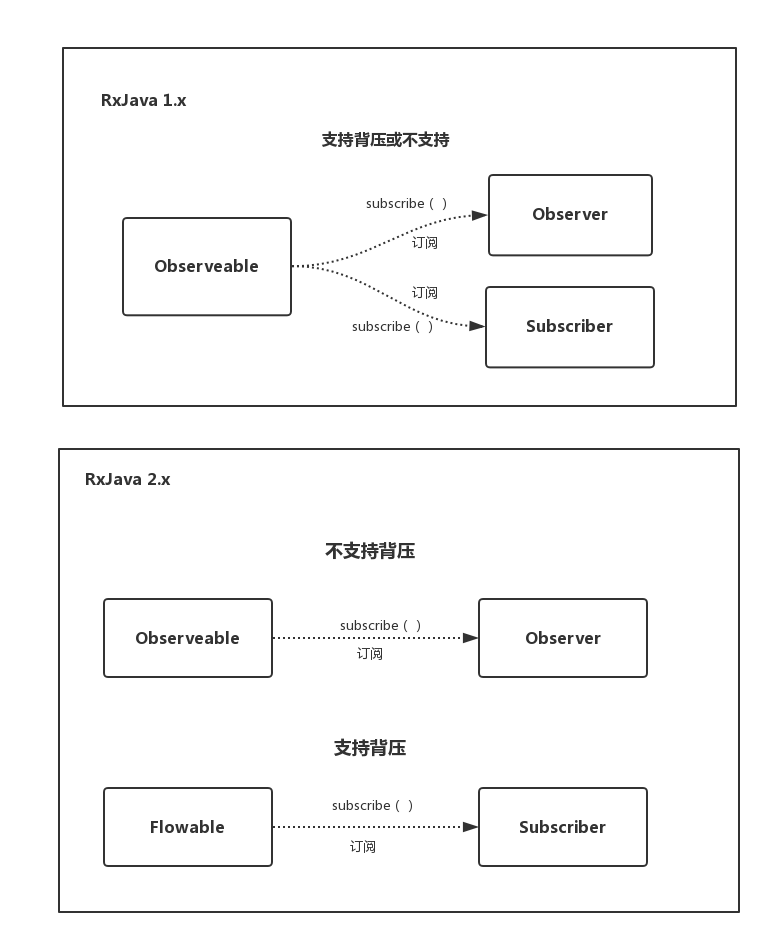

# Welcome to RxJava2

## Why

- RxJava2 完全遵循 Reactive-Streams 规范进行重写；
- 引入一套新的 Api，解决了 RxJava 中的背压问题；
- 支持更丰富更屌的操作符
- 2017.7.1－－不再支持新特性兼容，只修复遗留 BUG；
- 2018.3.31－－不再开发与维护。

> [Backpressure](https://zhuanlan.zhihu.com/p/24473022?refer=dreawer)



背压策略是指在异步场景中，被观察者发送事件速度远快于观察者的处理速度的情况下，一种告诉上游的被观察者降低发送速度的策略。简而言之，背压策略是流速控制的一种策略。

## 区别
### 仓库地址与包名

```
ompile "io.reactivex.rxjava2:rxjava:2.x.y"
```

### Nulls

RxJava 可以将 null 作为一个数据项 next 出去，在 RxJava2 中，以下流都将直接抛 NPT 异常：

```
Observable.just(null);

Single.just(null);

Observable.fromCallable(() -> null)
    .subscribe(System.out::println, Throwable::printStackTrace);

Observable.just(1).map(v -> null)
    .subscribe(System.out::println, Throwable::printStackTrace);
```

### 被观察者 Observable 与 Flowable

为了解决 RxJava 中的背压问题，RxJava2 引入了一套新的被观察者－－ Flowable。

在 RxJava2 中：

- Observable 会将没有消费的数据保存在内存中直到 OutOfMemoryError 而不会抛出 MissBackpressureException；
- Flowable 支持背压，可以在 Flowable.create() 创建时指定背压策略。如：BackpressureStrategy.DROP。



#### 使用场景

##### 什么时候使用 Observable？
- 流的数据不超过 1k 个
- 接受 UI 事件，比如：鼠标移动或点击事件

##### 什么时候使用 Flowable？
- 流的数据超过 10k 个
- 一系列可能阻塞消费的操作（解析文件、网络请求或数据库操作等）
－ 目前是阻塞的将来可能变成非阻塞的数据源

### 观察者新成员

RxJava2 整个架构严格按照 Reactive-Streams 规范设计, 基本的消费者类型都改为了接口。

#### Single

```
interface SingleObserver<T> {
    void onSubscribe(Disposable d);
    void onSuccess(T value);
    void onError(Throwable error);
}
```

Single 只关心调用成功后对数据的处理，订阅之后只能接收到一次数据。如果数据发射成功则调用 onSuccess，发射失败调用 onError。
普通 Observable 可以使用 toSingle 转换：

```
Observable.just(1).toSingle()
```

#### Completable
```
interface CompletableObserver<T> {
    void onSubscribe(Disposable d);
    void onComplete();
    void onError(Throwable error);
}
```

Completable 只关心是否调用成功。同样也可以由普通的 Observable 转换而来：
```
Observable.just(1).toCompletable()
```

#### Maybe
Maybe 可能出现无数据或只有一个数据的情况，所以 onSuccess() 和 onComplete() 只会调用其中一个。可以理解成是 Single 和 Completable 的结合体。适用于可能发射 1 个或者 0 个的数据源。

### 被观察者新成员

与 Reactive-Streams 中 Flowable extends Publisher<T> 风格一样，其他基本响应类也有类似的基础接口：

```
interface ObservableSource<T> {
    void subscribe(Observer<? super T> observer);
}

interface SingleSource<T> {
    void subscribe(SingleObserver<? super T> observer);
}

interface CompletableSource {
    void subscribe(CompletableObserver observer);
}

interface MaybeSource<T> {
    void subscribe(MaybeObserver<? super T> observer);
}
```

> 可订阅的对象在 RxJava 中只有 Observable 一种，之前我们经常会直接把数据源称作 Observable。
> 而在 RxJava2 中扩充成了 4 种，因此在之后还是把他们统称为数据源为宜。

所以现在的操作符也接受 Publisher 和 XSource：
```
Flowable<R> flatMap(Function<? super T, ? extends Publisher<? extends R>> mapper);
Observable<R> flatMap(Function<? super T, ? extends ObservableSource<? extends R>> mapper);
```
由于接收的都是接口，在使用其他遵循 Reactive-Streams 设计的第三方库的时候，就不需要把他自定义的 Flowable 转换成标准 Flowable 了。

### Subjects 与 Processors
同样是为了解决 Backpressure 问题，把 Subjects 分为了 Subjects 和 Processors：
- io.reactivex.subjects.AsyncSubject
- io.reactivex.subjects.BehaviorSubject
- io.reactivex.subjects.PublishSubject
- io.reactivex.subjects.ReplaySubject io.reactivex.subjects.UnicastSubject

不支持 Backpressure，属于 Observable 系列。

- io.reactivex.processors.AsyncProcessor 
- io.reactivex.processors.BehaviorProcessor 
- io.reactivex.processors.PublishProcessor 
- io.reactivex.processors.ReplayProcessor io.reactivex.processors.UnicastProcessor

支持 Backpressure ，属于 Flowable 系列。

### TestSubject
RxJava TestSubject 已被弃用。现在通过 TestScheduler，PublishProcessor/PublishSubject 和 observeOn(TestScheduler) 代替。

```
TestScheduler scheduler = new TestScheduler();
PublishSubject<Integer> ps = PublishSubject.create();

TestObserver<Integer> ts = ps.delay(1000, TimeUnit.MILLISECONDS, scheduler)
.test();

ts.assertEmpty();

ps.onNext(1);

scheduler.advanceTimeBy(999, TimeUnit.MILLISECONDS);

ts.assertEmpty();

scheduler.advanceTimeBy(1, TimeUnit.MILLISECONDS);

ts.assertValue(1);
```

### SerializedSubject
SerializedSubject 由 Subject.toSerialized() 和 FlowableProcessor.toSerialized() 代替。

### 其他类
rx.observables.GroupedObservable 由 io.reactivex.observables.GroupedObservable<T> 和 
io.reactivex.flowables.GroupedFlowable<T> 代替。

### Functional 接口
RxJava2 定义了自己的 Functional 接口，默认定义了 throws Exception，不需要再内部 try-catch。
```
Flowable.just("file.txt")
.map(name -> Files.readLines(name))
.subscribe(lines -> System.out.println(lines.size()), Throwable::printStackTrace);
```
### Actions
Actions 接口的命名符合 Java8 命名规范。
- Func -> Function, Action0/Action1/Action2 -> Action/Consumer/BiConsumer；
- 删除了 Action3-9/Func3-9。由 Action<Object[]>/Function<Object[],R> 代替。

### Subscriber
```
Flowable.range(1, 10).subscribe(new Subscriber<Integer>() {
    @Override
    public void onSubscribe(Subscription s) {
        s.request(Long.MAX_VALUE);
    }

    @Override
    public void onNext(Integer t) {
        System.out.println(t);
    }

    @Override
    public void onError(Throwable t) {
        t.printStackTrace();
    }

    @Override
    public void onComplete() {
        System.out.println("Done");
    }
});
```

Reactive-Streams 规范中已经定义了 Subscriber 接口，所以以前的 Subscriber 类的职能现在由 Subscriber 接口的实现类代替：
- DefaultSubscriber
- ResourceSubscriber
- DisposableSubscriber
- 以及相应的XObserver 变体
因为以上都继承了 Disposable 所以也支持通过 dispose() 来断开对数据源的监听。

```
ResourceSubscriber<Integer> subscriber = new ResourceSubscriber<Integer>() {
    @Override
    public void onStart() {
        request(Long.MAX_VALUE);
    }

    @Override
    public void onNext(Integer t) {
        System.out.println(t);
    }

    @Override
    public void onError(Throwable t) {
        t.printStackTrace();
    }

    @Override
    public void onComplete() {
        System.out.println("Done");
    }
};

Flowable.range(1, 10).delay(1, TimeUnit.SECONDS).subscribe(subscriber);

subscriber.dispose();
```

几个变化：
- CompositeSubscription -> CompositeDisposable
- subscribe() 不返回值
- subscribWith() 返回 CompositeDisposable
- onCompleted() -> onComplete()
- request() 决定 subscriber最大接受多少个事件

最常见的，RxJava 中要对一个长监听的 Observable 反注册，通常的做法是：

```
CompositeSubscription composite = new CompositeSubscription();

composite.add(Observable.range(1, 5).subscribe(new TestSubscriber<Integer>()));
```

RxJava2 subscribe() 不返回值，因此需要该用 subscribWith() 返回 CompositeDisposable：
```
CompositeDisposable composite2 = new CompositeDisposable();

composite2.add(Flowable.range(1, 5).subscribeWith(subscriber));
```

request()的一个列子：
```
Flowable.range(1, 3).subscribe(new Subscriber<Integer>() {

    @Override
    public void onSubscribe(Subscription s) {
        System.out.println("OnSubscribe start");
        s.request(Long.MAX_VALUE);
        System.out.println("OnSubscribe end");
    }

    @Override
    public void onNext(Integer v) {
        System.out.println(v);
    }

    @Override
    public void onError(Throwable e) {
        e.printStackTrace();
    }

    @Override
    public void onComplete() {
        System.out.println("Done");
    }
});
```

打印结果：
```
OnSubscribe start
1
2
3
Done
OnSubscribe end
```

### Schedulers
- RxJava2 仍然支持：computation, io, newThread,trampoline；
- 移除：immediate -> tranmpoline；
- 移除：test() -> new TestScheduler()；
- 启动 Scheduler 无需再 createWorker；
- new() 现在接受 TimeUnit 参数。

### 更安全的创建方式
将普通方法转换成 RxJava 的数据源，在RxJava中，提供了 Observable.create() 方法。但是这个方法过于强大，但使用时需要注意的东西太多经常会发生错误。
因此在 RxJava2 中，把原来的 fromAsync 重命名成了 create，fromAsync 是一个和 create 类似但更为简单和安全的方法，这样大部分旧代码都能够继续使用。
```
Flowable.create((FlowableEmitter<Integer> emitter) -> {
    emitter.onNext(1);
    emitter.onNext(2);
    emitter.onComplete();
}, BackpressureStrategy.BUFFER);
```

### 从响应式流离开
```
List<Integer> list = Flowable.range(1, 100).toList().blockingGet(); // toList() returns Single
Integer i = Flowable.range(100, 100).blockingLast();
```
另一个关于 rx.Subscriber 和 org.reactivestreams.Subscriber 的重大变化是 Subscribers 和 Observers 内部不再允许 throws 任何东西除了致命异常（参见 Exceptions.throwIfFatal()）,所以下面的代码现在不合法：
```
Subscriber<Integer> subscriber = new Subscriber<Integer>() {
    @Override
    public void onSubscribe(Subscription s) {
        s.request(Long.MAX_VALUE);
    }

    public void onNext(Integer t) {
        if (t == 1) {
            throw new IllegalArgumentException();
        }
    }

    public void onError(Throwable e) {
        if (e instanceof IllegalArgumentException) {
            throw new UnsupportedOperationException();
        }
    }

    public void onComplete() {
        throw new NoSuchElementException();
    }
};

Flowable.just(1).subscribe(subscriber);
```
Observer, SingleObserver, MaybeObserver and CompletableObserver 同理。

如果必须要这样 throws 可以选择使用 safeSubscribe() 或 subscribe(Consumer<T>, Consumer<Throwable>, Action) 的相关 Consumer 进行重载。

### 操作符调整
主要包括命名、参数和返回值的差异。

[Factory Methods Wiki](https://github.com/ReactiveX/RxJava/wiki/What's-different-in-2.0#factory-methods)

### 单元测试相关
// TODO

### Demos

一老外哥们写的 RxJava2 Demo：

[RxJava2-Android-Samples](https://github.com/amitshekhariitbhu/RxJava2-Android-Samples)

## 小结

- 引入一套新的 Observable，解决了 Backpressure 问题，并产生了大量关联的修正；
- 按照 Reactive-Streams 规范对整个架构进行了重新设计；
- 一些的其它零散更新。

## 参考
- [What's different in 2.0](https://github.com/ReactiveX/RxJava/wiki/What's-different-in-2.0)
- [Backpressure](https://github.com/ReactiveX/RxJava/wiki/Backpressure)
- [关于RxJava最友好的文章——背压（Backpressure）](https://zhuanlan.zhihu.com/p/24473022?refer=dreawer)
- [关于 RxJava 最友好的文章—— RxJava 2.0 全新来袭](https://zhuanlan.zhihu.com/p/24482660)
